# Code Collaborative Review

A REST API for collaborative code review built with **Node.js, Express, TypeScript, PostgreSQL, JWT authentication, and WebSockets**.

The system allows users to register as either **Submitters** or **Reviewers**. Submitters can submit code for review, while Reviewers can review submissions, leave comments, approve submissions, or request changes.

The application also provides project statistics, persistent notifications, validation, error handling, and real-time updates using WebSockets.

---

## Features

### Authentication

- User registration
- User login
- Password hashing using bcrypt
- JWT authentication
- Role-based authorization
- Submitter and Reviewer roles

### User Profiles

Users can:

- View their profile
- Update their name
- Update their email
- Update their display picture
- Delete their profile

Users can only update or delete their own profiles.

### Projects

Users can:

- Create projects
- View projects
- Assign members to projects
- Remove members from projects
- View project submissions
- View project statistics

### Code Submissions

Submitters can:

- Submit code for review
- View submissions
- Delete their own submissions

Reviewers can:

- View submissions
- Update submission status
- Approve submissions
- Request changes

Submission statuses include:

```text
pending
in_review
approved
changes_requested
```

### Comments

Reviewers can:

- Add comments to submissions
- View comments
- Update their own comments
- Delete their own comments

Submitters can view comments but cannot create Reviewer comments.

### Review Workflow

Reviewers can:

- Approve submissions
- Request changes
- View review history

Review actions are stored in PostgreSQL.

### Notifications

When a Reviewer approves a submission or requests changes, a notification is created for the Submitter.

Notifications are stored in PostgreSQL so they can still be retrieved if the user was offline.

### Real-Time Updates

The project uses WebSockets to provide real-time review notifications.

WebSocket connections are authenticated using JWT.

### Project Statistics

Project statistics are calculated dynamically from PostgreSQL data.

Statistics include:

- Total submissions
- Pending submissions
- In-review submissions
- Approved submissions
- Changes-requested submissions
- Submission status percentages
- Average review time
- Reviewer activity
- Submission with the most comments

No project statistics are hard-coded.

### Validation

Reusable validation middleware handles:

- Required fields
- Email format
- User roles
- Submission statuses
- Route IDs

### Error Handling

Centralized error-handling middleware handles:

- Invalid routes
- Invalid input
- Unauthorized requests
- Forbidden actions
- Resources that do not exist
- Internal server errors

---

# Technologies

- Node.js
- TypeScript
- Express.js
- PostgreSQL
- pg
- JSON Web Token
- bcrypt
- WebSockets (`ws`)
- dotenv
- Nodemon
- tsx

---

# Project Structure

```text
code-collaborative-review/
│
├── src/
│   ├── config/
│   │   └── db.ts
│   │
│   ├── controllers/
│   │   ├── authController.ts
│   │   ├── userController.ts
│   │   ├── projectController.ts
│   │   ├── submissionController.ts
│   │   ├── commentController.ts
│   │   ├── reviewController.ts
│   │   └── notificationController.ts
│   │
│   ├── middleware/
│   │   ├── authMiddleware.ts
│   │   ├── errorMiddleware.ts
│   │   └── validationMiddleware.ts
│   │
│   ├── routes/
│   │   ├── authRoutes.ts
│   │   ├── userRoutes.ts
│   │   ├── projectRoutes.ts
│   │   ├── submissionRoutes.ts
│   │   ├── commentRoutes.ts
│   │   ├── reviewRoutes.ts
│   │   └── notificationRoutes.ts
│   │
│   ├── server.ts
│   └── websocket.ts
│
├── screenshots/
├── .env
├── package.json
├── tsconfig.json
└── README.md
```

---

# Installation

## 1. Clone the Repository

```bash
git clone <repository-url>
```

Move into the project:

```bash
cd code-collaborative-review
```

---

## 2. Install Dependencies

```bash
npm install
```

The main dependencies are:

```text
bcrypt
dotenv
express
jsonwebtoken
pg
ws
```

Development dependencies include:

```text
typescript
tsx
nodemon
@types/node
@types/express
@types/bcrypt
@types/jsonwebtoken
@types/pg
@types/ws
```

---

# PostgreSQL Setup

The application requires PostgreSQL.

Create a PostgreSQL database for the project and configure the connection using environment variables.

The project uses the following tables:

```text
users
projects
project_members
submissions
comments
reviews
notifications
```

These tables store users, projects, project membership, code submissions, comments, review history, and notifications.

---

# Environment Variables

Create a `.env` file in the root of the project.

Example:

```env
PORT=3000

DB_USER=postgres
DB_HOST=localhost
DB_NAME=code_collaborative_review
DB_PASSWORD=your_postgresql_password
DB_PORT=5432

JWT_SECRET=your_secret_key
```

Use your own PostgreSQL credentials and JWT secret.

Do not commit `.env` to GitHub.

Add the following to `.gitignore`:

```text
.env
node_modules/
dist/
```

---

# Running the Project

## Development Mode

Run:

```bash
npm run dev
```

This runs:

```text
nodemon --exec tsx src/server.ts
```

The REST API runs at:

```text
http://localhost:3000
```

The WebSocket server runs at:

```text
ws://localhost:3000
```

---

# Building the Project

Compile TypeScript:

```bash
npm run build
```

This runs:

```text
tsc
```

---

# Production Mode

After building the project:

```bash
npm start
```

This runs:

```text
node dist/server.js
```

---

# Authentication

Protected endpoints require a JWT.

First log in using:

```text
POST http://localhost:3000/api/auth/login
```

Copy the JWT returned by the API.

In Postman:

1. Open the **Authorization** tab.
2. Select **Bearer Token**.
3. Paste the JWT.
4. Send the request.

The request will contain:

```text
Authorization: Bearer YOUR_JWT
```

---

# User Roles

## Submitter

A Submitter can:

- Create code submissions
- View submissions
- View comments
- View notifications
- Delete their own submissions
- Manage their own profile

## Reviewer

A Reviewer can:

- View submissions
- Update submission status
- Add comments
- Update their own comments
- Delete their own comments
- Approve submissions
- Request changes
- View review history
- Assign project members
- Remove project members

---

# API Endpoints

## Authentication

### Register User

**Method:** `POST`

**Endpoint:**

```text
http://localhost:3000/api/auth/register
```

Example body:

```json
{
  "name": "Test User",
  "email": "test@example.com",
  "password": "password123",
  "role": "submitter"
}
```

Valid roles:

```text
submitter
reviewer
```

---

### Login

**Method:** `POST`

**Endpoint:**

```text
http://localhost:3000/api/auth/login
```

Example body:

```json
{
  "email": "test@example.com",
  "password": "password123"
}
```

A successful login returns a JWT that can be used on protected routes.

---

# User Profiles

### Get User Profile

**Method:** `GET`

**Endpoint:**

```text
http://localhost:3000/api/users/:id
```

Example:

```text
http://localhost:3000/api/users/1
```

---

### Update User Profile

**Method:** `PUT`

**Endpoint:**

```text
http://localhost:3000/api/users/:id
```

Example:

```text
http://localhost:3000/api/users/1
```

Example body:

```json
{
  "name": "Test User",
  "email": "test@example.com",
  "display_picture": "https://example.com/profile.jpg"
}
```

Users can only update their own profiles.

---

### Delete User Profile

**Method:** `DELETE`

**Endpoint:**

```text
http://localhost:3000/api/users/:id
```

Example:

```text
http://localhost:3000/api/users/1
```

Users can only delete their own profiles.

---

# Projects

### Create Project

**Method:** `POST`

**Endpoint:**

```text
http://localhost:3000/api/projects
```

Example body:

```json
{
  "name": "Code Review Project"
}
```

---

### Get All Projects

**Method:** `GET`

**Endpoint:**

```text
http://localhost:3000/api/projects
```

---

### Assign Member to Project

**Method:** `POST`

**Endpoint:**

```text
http://localhost:3000/api/projects/:id/members
```

Example:

```text
http://localhost:3000/api/projects/1/members
```

Example body:

```json
{
  "user_id": 2
}
```

---

### Remove Member From Project

**Method:** `DELETE`

**Endpoint:**

```text
http://localhost:3000/api/projects/:id/members/:userId
```

Example:

```text
http://localhost:3000/api/projects/1/members/2
```

---

### Get Project Submissions

**Method:** `GET`

**Endpoint:**

```text
http://localhost:3000/api/projects/:id/submissions
```

Example:

```text
http://localhost:3000/api/projects/1/submissions
```

---

### Get Project Statistics

**Method:** `GET`

**Endpoint:**

```text
http://localhost:3000/api/projects/:id/stats
```

Example:

```text
http://localhost:3000/api/projects/1/stats
```

Example response:

```json
{
  "project": {
    "id": 1,
    "name": "Code Review Project"
  },
  "submissions": {
    "total": 4,
    "pending": 1,
    "in_review": 1,
    "approved": 1,
    "changes_requested": 1
  },
  "percentages": {
    "pending": 25,
    "in_review": 25,
    "approved": 25,
    "changes_requested": 25
  },
  "average_review_time_minutes": 10.5,
  "reviewer_activity": [],
  "most_commented_submission": null
}
```

Statistics depend on the data currently stored in PostgreSQL.

---

# Submissions

### Create Submission

**Submitter only**

**Method:** `POST`

**Endpoint:**

```text
http://localhost:3000/api/submissions
```

Example body:

```json
{
  "project_id": 1,
  "code": "const message = 'Hello World';"
}
```

The logged-in Submitter is automatically recorded as the owner.

---

### Get Single Submission

**Method:** `GET`

**Endpoint:**

```text
http://localhost:3000/api/submissions/:id
```

Example:

```text
http://localhost:3000/api/submissions/1
```

---

### Update Submission Status

**Reviewer only**

**Method:** `PATCH`

**Endpoint:**

```text
http://localhost:3000/api/submissions/:id/status
```

Example:

```text
http://localhost:3000/api/submissions/1/status
```

Example body:

```json
{
  "status": "in_review"
}
```

Allowed statuses:

```text
pending
in_review
approved
changes_requested
```

---

### Delete Submission

**Submitter only**

**Method:** `DELETE`

**Endpoint:**

```text
http://localhost:3000/api/submissions/:id
```

Example:

```text
http://localhost:3000/api/submissions/1
```

A Submitter can only delete their own submission.

---

# Comments

### Add Comment

**Reviewer only**

**Method:** `POST`

**Endpoint:**

```text
http://localhost:3000/api/submissions/:id/comments
```

Example:

```text
http://localhost:3000/api/submissions/1/comments
```

Example body:

```json
{
  "comment": "Consider moving this logic into a separate function."
}
```

---

### Get Submission Comments

**Method:** `GET`

**Endpoint:**

```text
http://localhost:3000/api/submissions/:id/comments
```

Example:

```text
http://localhost:3000/api/submissions/1/comments
```

---

### Update Comment

**Reviewer only**

**Method:** `PUT`

**Endpoint:**

```text
http://localhost:3000/api/comments/:id
```

Example:

```text
http://localhost:3000/api/comments/1
```

Example body:

```json
{
  "comment": "Updated review comment."
}
```

A Reviewer can only update their own comment.

---

### Delete Comment

**Reviewer only**

**Method:** `DELETE`

**Endpoint:**

```text
http://localhost:3000/api/comments/:id
```

Example:

```text
http://localhost:3000/api/comments/1
```

A Reviewer can only delete their own comment.

---

# Review Workflow

### Approve Submission

**Reviewer only**

**Method:** `POST`

**Endpoint:**

```text
http://localhost:3000/api/submissions/:id/approve
```

Example:

```text
http://localhost:3000/api/submissions/1/approve
```

When a submission is approved:

1. The submission status changes to `approved`.
2. A review-history record is created.
3. A notification is stored for the Submitter.
4. A live WebSocket notification is sent if the Submitter is connected.

---

### Request Changes

**Reviewer only**

**Method:** `POST`

**Endpoint:**

```text
http://localhost:3000/api/submissions/:id/request-changes
```

Example:

```text
http://localhost:3000/api/submissions/1/request-changes
```

When changes are requested:

1. The submission status changes to `changes_requested`.
2. A review-history record is created.
3. A notification is stored for the Submitter.
4. A live WebSocket notification is sent if the Submitter is connected.

---

### Get Review History

**Method:** `GET`

**Endpoint:**

```text
http://localhost:3000/api/submissions/:id/reviews
```

Example:

```text
http://localhost:3000/api/submissions/1/reviews
```

---

# Notifications

### Get User Notifications

**Method:** `GET`

**Endpoint:**

```text
http://localhost:3000/api/users/:id/notifications
```

Example:

```text
http://localhost:3000/api/users/1/notifications
```

Notifications remain stored in PostgreSQL even if the user is not connected to the WebSocket server.

---

# Endpoint Summary

| Method | Endpoint | Description |
|---|---|---|
| POST | `http://localhost:3000/api/auth/register` | Register user |
| POST | `http://localhost:3000/api/auth/login` | Login |
| GET | `http://localhost:3000/api/users/:id` | Get user profile |
| PUT | `http://localhost:3000/api/users/:id` | Update user profile |
| DELETE | `http://localhost:3000/api/users/:id` | Delete user profile |
| POST | `http://localhost:3000/api/projects` | Create project |
| GET | `http://localhost:3000/api/projects` | Get all projects |
| POST | `http://localhost:3000/api/projects/:id/members` | Assign member |
| DELETE | `http://localhost:3000/api/projects/:id/members/:userId` | Remove member |
| GET | `http://localhost:3000/api/projects/:id/submissions` | Get project submissions |
| GET | `http://localhost:3000/api/projects/:id/stats` | Get project statistics |
| POST | `http://localhost:3000/api/submissions` | Create submission |
| GET | `http://localhost:3000/api/submissions/:id` | Get submission |
| PATCH | `http://localhost:3000/api/submissions/:id/status` | Update submission status |
| DELETE | `http://localhost:3000/api/submissions/:id` | Delete submission |
| POST | `http://localhost:3000/api/submissions/:id/comments` | Add comment |
| GET | `http://localhost:3000/api/submissions/:id/comments` | Get comments |
| PUT | `http://localhost:3000/api/comments/:id` | Update comment |
| DELETE | `http://localhost:3000/api/comments/:id` | Delete comment |
| POST | `http://localhost:3000/api/submissions/:id/approve` | Approve submission |
| POST | `http://localhost:3000/api/submissions/:id/request-changes` | Request changes |
| GET | `http://localhost:3000/api/submissions/:id/reviews` | Get review history |
| GET | `http://localhost:3000/api/users/:id/notifications` | Get notifications |

---

# WebSocket

The application uses WebSockets for real-time notifications.

The WebSocket connection requires a valid JWT.

First log in:

```text
POST http://localhost:3000/api/auth/login
```

Copy the JWT.

Then create a WebSocket request in Postman and connect to:

```text
ws://localhost:3000?token=YOUR_JWT
```

Do not add `Bearer` before the JWT in the WebSocket URL.

A successful connection returns:

```json
{
  "type": "connection",
  "message": "Connected to WebSocket server",
  "user_id": 1
}
```

Keep the Submitter's WebSocket connection open.

If a Reviewer approves the Submitter's submission, the Submitter can receive:

```json
{
  "type": "submission_approved",
  "notification": {
    "id": 1,
    "user_id": 1,
    "message": "Your submission 5 has been approved",
    "created_at": "..."
  }
}
```

If a Reviewer requests changes:

```json
{
  "type": "changes_requested",
  "notification": {
    "id": 2,
    "user_id": 1,
    "message": "Changes have been requested for your submission 5",
    "created_at": "..."
  }
}
```

If the Submitter is offline, the WebSocket message cannot be delivered, but the notification remains stored in PostgreSQL.

---

# Validation

The application contains reusable validation middleware.

Validation includes:

- Required fields
- Email format
- User roles
- Submission statuses
- Route IDs

Example invalid registration:

```text
POST http://localhost:3000/api/auth/register
```

Body:

```json
{
  "name": "Test User"
}
```

Response:

```json
{
  "message": "Missing required fields: email, password, role"
}
```

Example invalid email:

```json
{
  "name": "Test User",
  "email": "wrong-email",
  "password": "password123",
  "role": "submitter"
}
```

Response:

```json
{
  "message": "Invalid email format"
}
```

Example invalid route ID:

```text
GET http://localhost:3000/api/submissions/abc
```

Response:

```json
{
  "message": "Invalid id"
}
```

---

# Error Handling

The application uses centralized error-handling middleware.

For example:

```text
GET http://localhost:3000/api/hello
```

Response:

```json
{
  "message": "Route not found: GET /api/hello"
}
```

Status:

```text
404 Not Found
```

The API uses appropriate HTTP status codes including:

```text
200 OK
201 Created
400 Bad Request
401 Unauthorized
403 Forbidden
404 Not Found
409 Conflict
500 Internal Server Error
```

---

# Testing With Postman

A recommended testing order is:

1. Register a Submitter using `POST http://localhost:3000/api/auth/register`.
2. Register a Reviewer.
3. Login as the Submitter using `POST http://localhost:3000/api/auth/login`.
4. Copy the Submitter JWT.
5. Create a project.
6. Create a submission.
7. Login as the Reviewer.
8. Copy the Reviewer JWT.
9. View the submission.
10. Add a comment.
11. Update the submission status.
12. Approve the submission or request changes.
13. Check review history.
14. Login as the Submitter.
15. Check notifications.
16. Check project statistics.
17. Connect the Submitter to the WebSocket server.
18. Perform another review action using the Reviewer.
19. Confirm that the Submitter receives the WebSocket notification.

---

# Screenshots

The following screenshots demonstrate the main functionality of the Code Collaborative Review API.

## User Registration

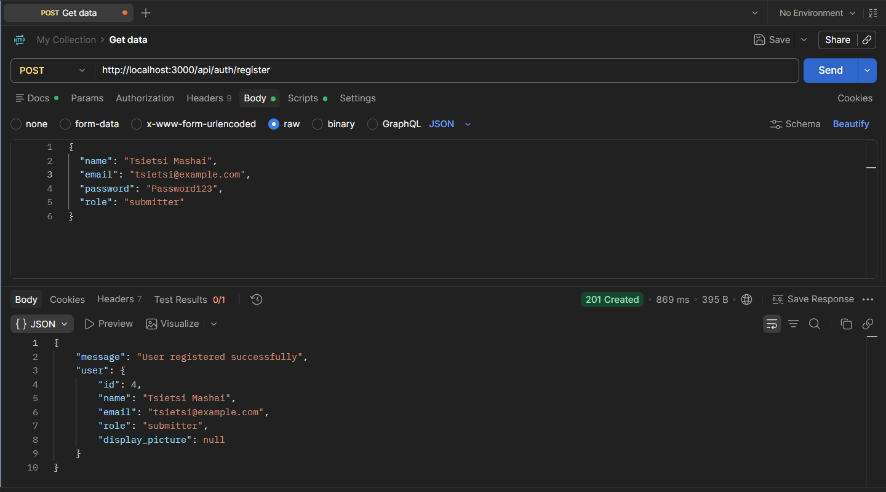

## User Login

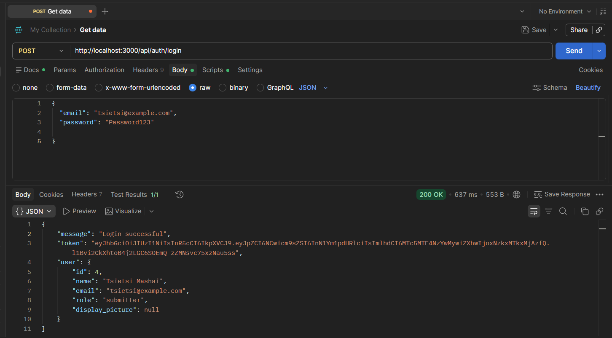

## Create Project

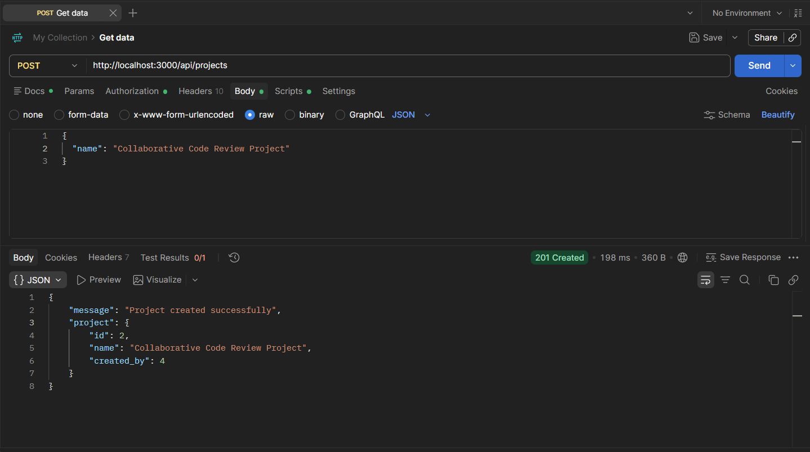

## Assign Project Member

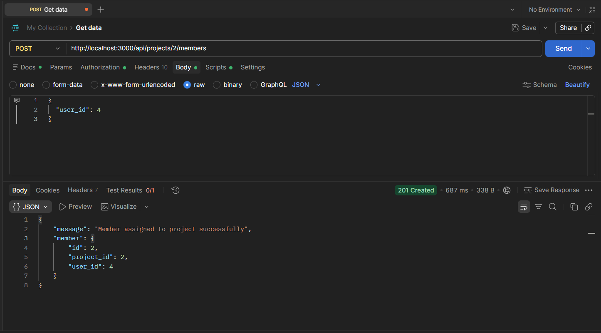

## Create Code Submission

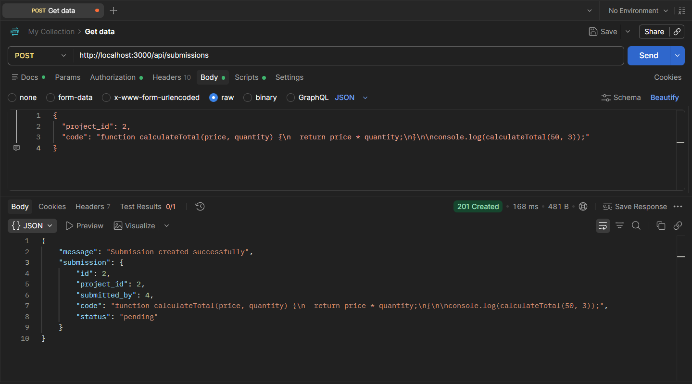

## View Project Submissions

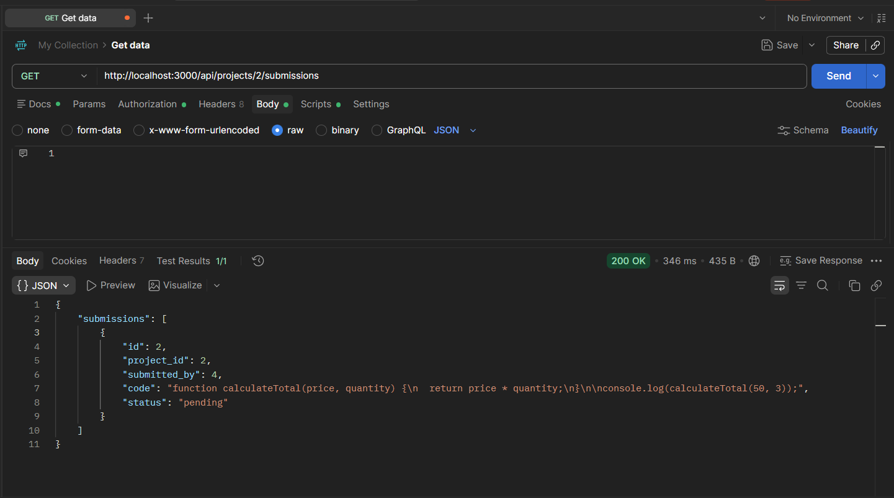

## Add Review Comment

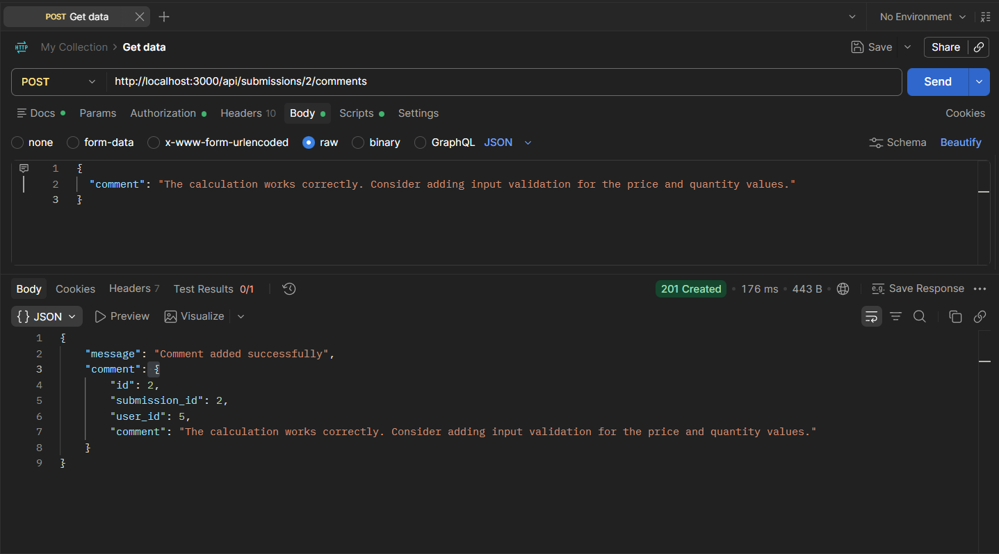

## Update Submission Status

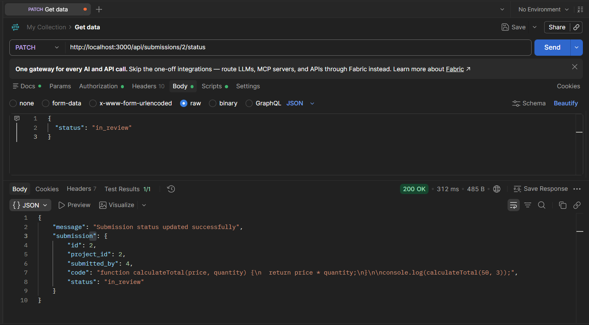

## Approve Submission

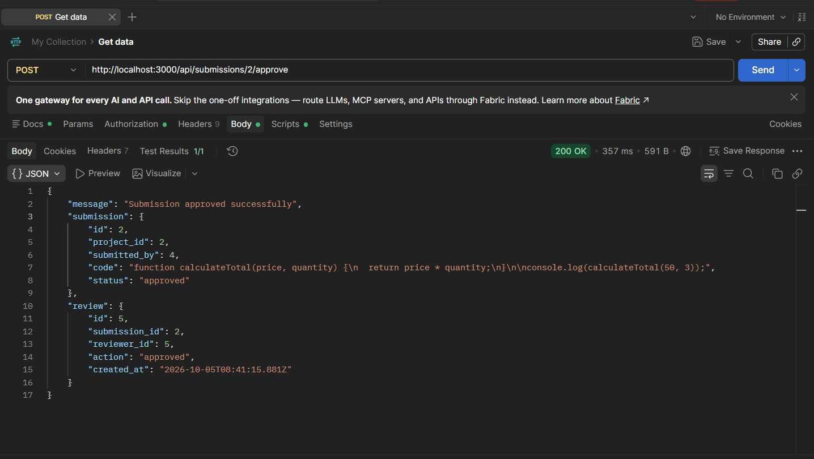

## Request Changes

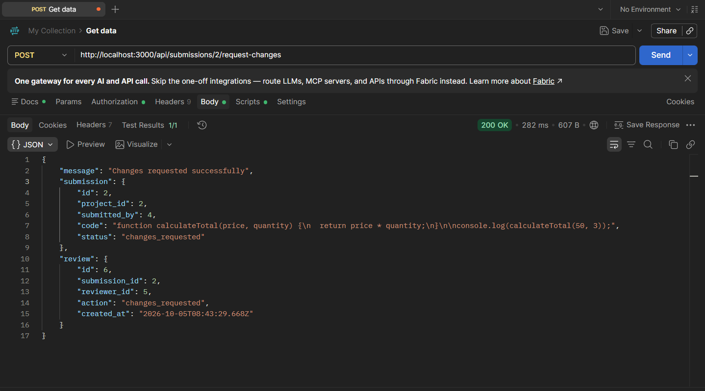

## Review History

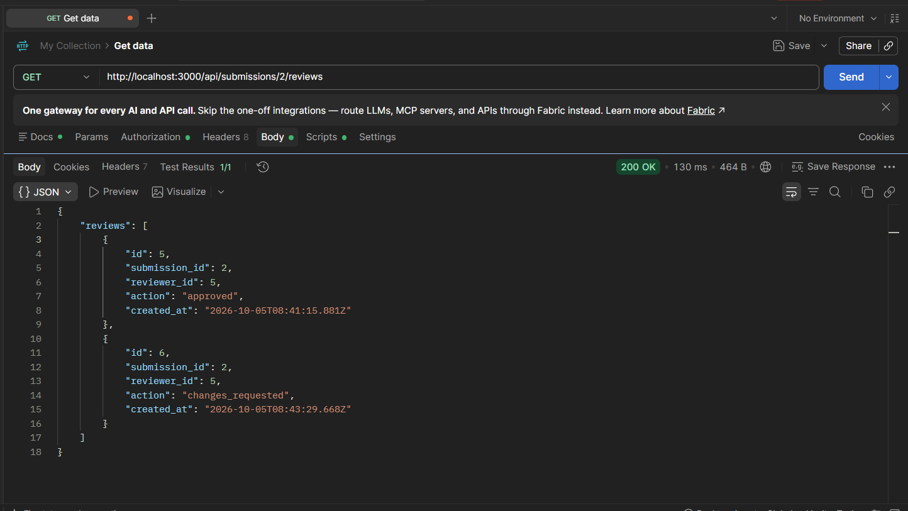

## User Notifications

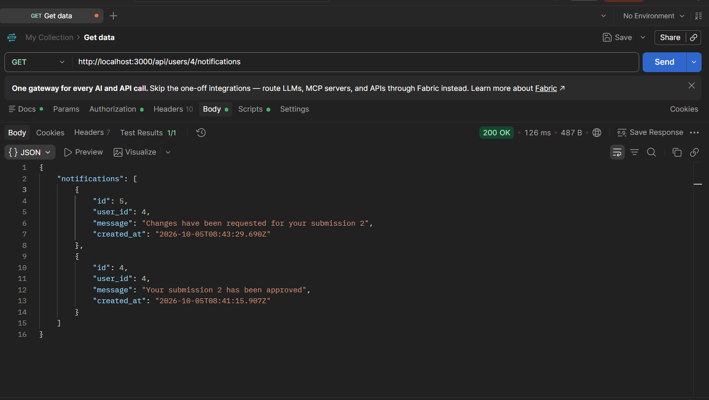

## Project Statistics

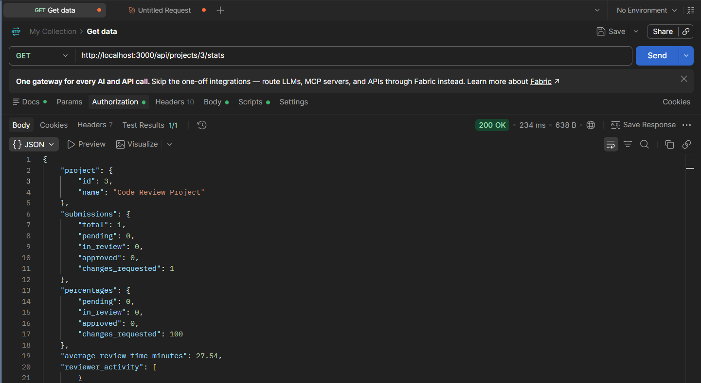

## WebSocket Connection


---

# Development Scripts

Start the development server:

```bash
npm run dev
```

Build the project:

```bash
npm run build
```

Start the compiled project:

```bash
npm start
```

---

# Security

The application includes:

- Password hashing with bcrypt
- JWT authentication
- Role-based authorization
- Protected API routes
- Resource ownership checks
- JWT-authenticated WebSocket connections
- Parameterized PostgreSQL queries
- Environment variables for sensitive information
- Request validation

PostgreSQL queries use placeholders such as:

```sql
WHERE id = $1
```

The value is supplied separately:

```ts
[id]
```

This prevents user input from being directly inserted into SQL query strings.

---
